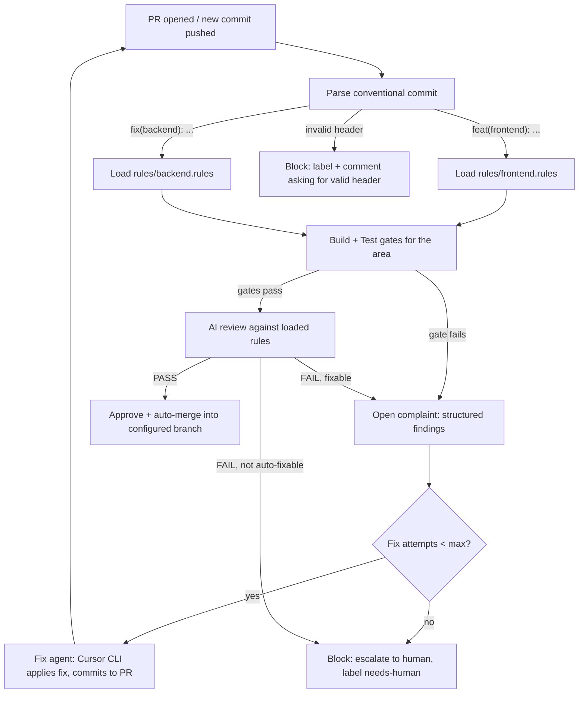

# Task 001 — Base Project: AI-Governed PR Pipeline

> **This is the original design document, kept as the record of how the project was planned and why.** For what the pipeline must do *today*, read [docs/SPECIFICATION.md](../SPECIFICATION.md), which is authoritative where the two differ — several details here were refined during implementation (see [Task 007](../007-spec-conformance/plan.md)).

| | |
|---|---|
| **Status** | 🟢 Approved — decisions locked 2026-07-16, build complete |
| **Author** | Claude (drafted for review by @0xb1te) |
| **Date** | 2026-07-16 |
| **Deliverables of this task** | This plan, [RULES.md](RULES.md), [AGENT.md](AGENT.md), plus phases 1–5 tracked as tasks 002–006 |

---

## 1. Goal

Build a versionable DevOps pipeline that governs pull requests automatically:

1. **Detect** the type and area of a change by interpreting its conventional-commit header (e.g. `feat(frontend): …`).
2. **Route** the PR through the rule set defined for that area (`rules/frontend.rules`, `rules/backend.rules`, …).
3. **Review** the PR with an AI reviewer that applies those rules and checks for hallucinations, low code quality, architectural errors, and vulnerabilities.
4. **Gate** every PR behind a real build and test run so nothing that crashes can reach the target branch.
5. **Decide**: **merge** (auto-merge into the configured target branch), **fix** (open a structured complaint and dispatch a fix agent via Cursor CLI that pushes a corrective commit to the same PR, re-triggering review), or **block** (escalate to a human when automation cannot resolve it).

The pipeline itself lives in this repository so its rules, prompts, and config are versioned, reviewed, and improved like any other code.

## 2. Core concept — PR lifecycle



Key property: the loop is **convergent by construction** — every fix commit re-enters the same pipeline, and a per-PR attempt counter guarantees termination (escalation to a human) instead of infinite AI ping-pong.

## 3. Proposed repository layout

```
ql-pipeline/
├── AGENT.md                     # Instructions for AI agents working on this repo (promoted from this task folder)
├── RULES.md                     # Development rules for this repo (promoted from this task folder)
├── README.md
├── pipeline.config.yml          # Default/fallback pipeline configuration — also doubles as schema docs for consumer repos
├── rules/                       # Per-area rule sets applied to incoming PRs (the shipped defaults, single source of truth)
│   ├── _common.rules            # Rules applied to every PR regardless of area
│   ├── frontend.rules
│   ├── backend.rules
│   ├── mobile.rules
│   ├── ios.rules
│   ├── android.rules
│   ├── infrastructure.rules
│   └── docs.rules
├── prompts/                     # Versioned prompt templates (both consumed by Cursor CLI, different context/intent)
│   ├── reviewer.md              # Read-only review prompt (rules get injected)
│   └── fixer.md                 # Fix-agent prompt (complaint gets injected, write-scoped)
├── src/                         # Pipeline implementation (TypeScript, Node 20+)
│   ├── commit-parser/           # Conventional-commit interpretation
│   ├── router/                  # Maps parsed commit -> rule files + gates (incl. consumer-repo rule overrides)
│   ├── reviewer/                # Builds review context, invokes cursor-agent (review mode), parses verdict
│   ├── verdict/                 # Decides merge / fix / block from review output
│   ├── fixer/                   # Invokes cursor-agent (fix mode) + enforces protected-path revert before commit
│   ├── merger/                  # Approval + auto-merge via GitHub API
│   └── shared/                  # Config loader, GitHub client, logging
├── .github/
│   └── workflows/
│       ├── pr-pipeline.yml      # The reusable workflow (on: workflow_call) — this IS the product
│       ├── dogfood.yml          # Thin caller: invokes pr-pipeline.yml for ql-pipeline's own PRs
│       └── self-check.yml       # CI for this repo's own src/ (lint, typecheck, unit tests) — unrelated to the reusable workflow
├── tests/                       # Unit + integration tests for src/
└── docs/
    ├── 001-first-task-base-project/   # This task
    └── integration-guide.md           # How a consumer repo adopts the reusable workflow (Phase 5)
```

Consumer repos never vendor this code — they call the reusable workflow by ref and optionally supply `.github/pipeline.config.yml` (overrides) and `.github/pipeline-rules/<area>.rules` (full per-area rule replacement; unset areas fall back to ql-pipeline's shipped defaults).

## 4. Components

### 4.1 Commit interpreter (`src/commit-parser`)

Parses the PR's commits (and the PR title as fallback) against the conventional-commit grammar:

```
<type>(<area>): <description>

type ::= feat | fix | refactor | perf | chore | docs | test | ci | build | revert
area ::= frontend | backend | mobile | ios | android | infrastructure | docs
```

- **Multi-commit PRs**: the union of areas found across commits is used; each area's rules are applied. If commits disagree wildly (e.g. `frontend` + `infrastructure`), all matched rule sets apply.
- **Invalid or missing header**: the PR is blocked immediately with a comment explaining the expected format — the AI never reviews unroutable changes.
- Output is a structured `RouteDecision { types[], areas[], ruleFiles[], gates[] }`.

### 4.2 Rule sets (`rules/*.rules`)

Plain-text/markdown files, one per area, each a self-contained review contract. Format:

```markdown
# frontend.rules
version: 1

## MUST (violations force FIX or BLOCK)
- No hardcoded API URLs; use the environment config module.
- Components must not exceed 300 lines; extract sub-components.
- No `any` in TypeScript; interfaces for all API payloads.
- All user-facing strings go through the i18n layer.

## SHOULD (violations are advisory, reported but non-blocking)
- Prefer composition over inheritance in components.

## SECURITY
- No dangerouslySetInnerHTML with unsanitized input.
- No secrets, tokens or keys in the diff.

## ARCHITECTURE
- UI components must not import from the data layer directly; go through hooks/services.
```

`_common.rules` (hallucination checks, secret scanning, dead-code, commit hygiene) is always appended. Rule files are **data, not code** — editing a rule changes reviewer behavior on the next PR without touching `src/`.

### 4.3 Build + test gates

Configured per area in `pipeline.config.yml` and executed **before** the AI review (no point reviewing code that doesn't compile):

```yaml
gates:
  frontend:
    build: "npm ci && npm run build"
    test:  "npm run test -- --ci"
  backend:
    build: "npm ci && npm run build"
    test:  "npm run test:unit && npm run test:integration"
  infrastructure:
    build: "terraform validate"
    test:  "tflint && checkov -d ."
```

A gate failure produces the same structured complaint as a review failure and feeds the same fix loop — a build break is just another fixable finding.

### 4.4 AI reviewer (`src/reviewer`)

- **Provider: Cursor CLI (`cursor-agent`)**, same engine as the fixer (§4.6), invoked in a distinct **review mode** with its own prompt template (`prompts/reviewer.md`). One AI vendor for the whole pipeline, single auth surface (`CURSOR_API_KEY`).
- Context assembled from: the PR diff, the matched `.rules` files, `_common.rules`, gate results, and the PR description. Invocation shape: `cursor-agent -p "<assembled context>" --output-format json` run from a **detached checkout** (not the PR's working branch) so the reviewer has nothing to write to — see the guard below.
- Read-only guard: after the review invocation, the pipeline runs `git status --porcelain` against that checkout. Any diff means the reviewer wrote to disk despite the prompt instructing otherwise — the run is hard-failed (treated as BLOCK), not silently accepted, because a reviewer that can edit is a reviewer that can hide what it edited.
- The reviewer is instructed to return a **strict JSON verdict** (schema-validated; a malformed response is retried once, then treated as BLOCK):

```json
{
  "verdict": "PASS | FAIL",
  "findings": [
    {
      "severity": "must | should | security",
      "rule": "frontend.rules#no-hardcoded-urls",
      "file": "src/api/client.ts",
      "line": 42,
      "problem": "Hardcoded production URL",
      "suggested_fix": "Import BASE_URL from src/config/env.ts",
      "auto_fixable": true
    }
  ]
}
```

- Grounding requirement: every finding must cite a rule ID and a file/line present in the diff — findings that reference nonexistent files or rules are discarded (this is our own hallucination guard on the reviewer).

### 4.5 Verdict engine (`src/verdict`)

Pure, unit-testable decision function:

| Condition | Decision |
|---|---|
| Gates pass + verdict PASS (no `must`/`security` findings) | **MERGE** |
| `must`/`security` findings, all `auto_fixable`, attempts < `max_fix_attempts` | **FIX** |
| Any non-auto-fixable finding, or attempts exhausted | **BLOCK** |

`should`-only findings never block; they are posted as advisory review comments and merged anyway.

### 4.6 Complaint + fix agent (`src/fixer`)

On **FIX**:

1. A **complaint** is opened as a structured PR review (request-changes) containing the findings JSON rendered as human-readable comments, plus a machine-readable block.
2. The fix agent checks out the PR branch and invokes **Cursor CLI** in non-interactive mode (`cursor-agent -p "<fixer prompt + complaint>" --output-format json`), scoped to the files named in the findings.
3. **Protected-path revert (defense-in-depth for R4)**: immediately after the agent runs and *before* anything is staged, the pipeline runs `git checkout -- rules/ prompts/ pipeline.config.yml .github/workflows/` on that checkout. This isn't just a prompt instruction — it structurally guarantees the fixer cannot alter the pipeline's own laws even if the prompt is ignored, jailbroken, or the agent misinterprets scope. Only if that checkout leaves the tree otherwise unchanged for a finding that specifically required one of those paths does the run fall through to BLOCK (a legitimate fix that needs a protected path always needs a human).
4. The agent commits with a conventional header carrying the loop marker, e.g. `fix(frontend): resolve pipeline complaint #<review-id> [bot]`, and pushes to the PR branch. **Commit and push are pipeline code, not agent-controlled** — the agent produces a working tree diff; the pipeline decides what actually gets committed and with what message, so commit hygiene (R2) is enforced regardless of what the agent does.
5. The push re-triggers the pipeline; the counter (`x-pipeline-attempt` stored in a PR comment or check output) increments.
6. At `max_fix_attempts` (default **3**) the PR is blocked with label `needs-human` and a summary of everything attempted.

Guards: the fixer may only touch files inside the PR's diff scope + files named in findings; the protected-path revert (step 3) backstops this structurally; commits by the bot identity are excluded from triggering a *new* attempt count reset.

### 4.7 Merge engine (`src/merger`)

On **MERGE**: approve the PR via API, then merge into the branch configured in `pipeline.config.yml`:

```yaml
merge:
  target_branch: main          # per-area override possible, e.g. mobile -> release/mobile
  method: merge                # squash | merge | rebase — merge commit: preserves full history incl. bot fix commits
  delete_branch: true
  required_checks: [build, test, ai-review]
```

Branch protection on the target branch remains the hard enforcement layer — the pipeline works *with* GitHub's protections, never bypasses them.

### 4.8 Reusable workflow contract

Per decision (§8), ql-pipeline ships as a **GitHub reusable workflow**, not vendored code. `.github/workflows/pr-pipeline.yml` in this repo is the product:

```yaml
# ql-pipeline/.github/workflows/pr-pipeline.yml
on:
  workflow_call:
    inputs:
      config-path:
        type: string
        default: .github/pipeline.config.yml   # path resolved in the CALLING repo
      ql-pipeline-ref:
        type: string
        default: main                          # pin a tag in production consumers
    secrets:
      CURSOR_API_KEY:
        required: true
      GH_TOKEN:
        required: false   # falls back to the calling workflow's default GITHUB_TOKEN
```

A consumer repo's entire integration is a thin caller workflow (see `docs/integration-guide.md`, Phase 5):

```yaml
# consumer-repo/.github/workflows/pr-governance.yml
name: PR Governance
on:
  pull_request:
    types: [opened, synchronize, reopened]
concurrency:
  group: pr-pipeline-${{ github.event.pull_request.number }}
  cancel-in-progress: true
jobs:
  govern:
    uses: 0xb1te/ql-pipeline/.github/workflows/pr-pipeline.yml@main
    secrets:
      CURSOR_API_KEY: ${{ secrets.CURSOR_API_KEY }}
```

Inside the reusable workflow, jobs run in the calling repo's PR context by default (that's how `workflow_call` works); a second `actions/checkout` with `repository: 0xb1te/ql-pipeline, ref: ${{ inputs.ql-pipeline-ref }}` pulls in `src/`, `rules/`, and `prompts/` alongside the consumer's checkout. `pipeline.config.yml` is read from the **consumer** repo (falling back to ql-pipeline's shipped defaults per missing key); `rules/*.rules` are ql-pipeline's shipped defaults unless the consumer supplies `.github/pipeline-rules/<area>.rules`, which fully replaces that area's rule set (no partial/deep merge — ambiguity here is worse than an all-or-nothing override).

ql-pipeline governs its own PRs too (dogfooding) via `.github/workflows/dogfood.yml`, a caller identical in shape to the consumer snippet above but using a local `uses: ./.github/workflows/pr-pipeline.yml`.

## 5. Use-case walkthroughs (acceptance criteria)

**UC1 — clean frontend change**
`feat(frontend): add dark-mode toggle` → parser routes to `frontend.rules` → frontend build+tests pass → AI review finds no `must`/`security` violations → verdict MERGE → PR approved and merged (merge commit) into `main` automatically. *Zero human interaction.*

**UC2 — flawed backend change**
`feat(backend): add payments endpoint` → routed to `backend.rules` → gates pass → AI review finds a SQL-injection risk (`security`, auto-fixable) → complaint posted as request-changes review → Cursor CLI fix agent patches the query to use parameterized statements, commits `fix(backend): resolve pipeline complaint #123 [bot]` → pipeline re-runs → review passes → auto-merge. If after 3 attempts it still fails → `needs-human` label + block.

## 6. Safety & guardrails

- **Loop guard**: hard `max_fix_attempts` per PR; bot commits are tagged and counted.
- **Concurrency**: one pipeline run per PR at a time (`concurrency: pr-${number}` with cancel-in-progress) so a fix commit cancels the stale run.
- **Privilege**: the workflow uses a fine-grained token; the fix agent gets write access only to PR branches, never to protected branches.
- **Secrets**: AI provider key and Cursor CLI auth live in GitHub Actions secrets; nothing in-repo.
- **Self-protection**: PRs that modify `rules/`, `prompts/`, `pipeline.config.yml`, or `.github/workflows/` are **always** routed to human review (the pipeline must not be able to rewrite its own laws).
- **Auditability**: every verdict, complaint, and fix attempt is persisted as PR comments/check outputs — the full decision trail is reconstructible from the PR alone.

## 7. Implementation phases

| Phase | Scope | Exit criteria |
|---|---|---|
| **0 (this task)** | Plan + RULES.md + AGENT.md | Plan approved by you |
| **1 — Skeleton** | Repo scaffolding: `pipeline.config.yml`, `rules/*` (initial rule sets), `prompts/*`, TS project setup, `self-check.yml` CI | `npm run build && npm test` green on empty modules; rules reviewed by you |
| **2 — Routing** | Commit parser + router + gate runner wired into `pr-pipeline.yml` | A test PR gets correctly routed, gated, and labeled with its area |
| **3 — Review** | AI reviewer + verdict engine (merge/block only, no fixer yet) | UC1 works end-to-end: clean PR auto-merges |
| **4 — Fix loop** | Complaint format + Cursor CLI fix agent + attempt counter | UC2 works end-to-end: flawed PR gets fixed by the bot and merges |
| **5 — Hardening** | Self-protection routing, concurrency, metrics summary comment, docs | Chaos tests: malformed commits, unfixable PRs, reviewer JSON garbage — all end in safe BLOCK states |

Each phase = its own task folder (`docs/00N-*/plan.md`) + PR, following [RULES.md](RULES.md).

## 8. Decisions (resolved 2026-07-16)

| # | Question | Decision |
|---|---|---|
| 1 | CI platform | **GitHub Actions** |
| 2 | Implementation language | **TypeScript on Node 20** |
| 3 | AI reviewer provider | **Cursor CLI does both** review and fix — single AI vendor/dependency, one auth surface (`CURSOR_API_KEY`). Reviewer and fixer are still separate prompt templates and separate invocation modes (read-only checkout vs. write-scoped checkout); see §4.4/§4.6. |
| 4 | Target repos | **Reusable workflow from day one** — ql-pipeline ships `.github/workflows/pr-pipeline.yml` as a `workflow_call` target; see §4.8. |
| 5 | Merge method | **Merge commit** (not squash) — preserves full history including intermediate bot fix commits. |
| 6 | `max_fix_attempts` | **3** |

These decisions are load-bearing for Phase 1 onward (§7) — reopening one after Phase 2 begins means re-scaffolding, so treat them as fixed unless something concrete in implementation proves one wrong.

## 9. Out of scope (for now)

- Deployment/CD after merge (this is PR governance, not delivery).
- Multi-repo rule federation, dashboards/UI, cost tracking for AI calls.
- Non-GitHub platforms.

---

*Approved 2026-07-16. [RULES.md](RULES.md) and [AGENT.md](AGENT.md) are promoted to the repository root; phases 1–5 are tracked as Tasks 002–006, each with its own task-folder plan under `docs/`.*
